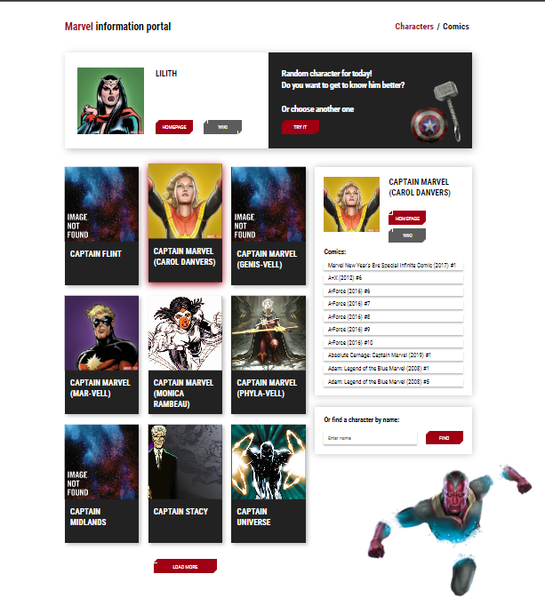

# Сервис комиксов Marvel и их героев.
### [Готовый проект](https://marvel-service-lyart.vercel.app/)

## Функциональность
**На главной странице** есть 3 основных компонента:
1. **Список героев**    
   Изначально выводится элементов, при нажатии на кнопку пагинации подгружаются следующие элементы.    
   При нажатии на карточку героя она выделяется и выбранный персонаж появляется в компоненте "Информация о герое"
2. **Информация о герое**    
   Если нет выбранного персонажа, то рендерится скелетон.    
   При клике на карточку героя или поиске по его имени отображается список соотвествующих комиксов.
3. **Рандомный герой**    
   При нажатии на кнопку "Tru it" отображатеся рандомный герой

**На странице комиксов** с использованием пагинации выводится по 8 карточек комиксов при клике на которые открывается отдельная страница комикса.    

**На отдельной странице комикса** отображается его обложка, описание и стоимость. Также можно вернуться ко всем комиксам.

## Технологии
+ ReactJS
+ Formik
+ Yup
+ Helmet-react
+ HTML
+ Scss (+ методолгия БЭМ)

Использовался открытый API https://developer.marvel.com/.

  
